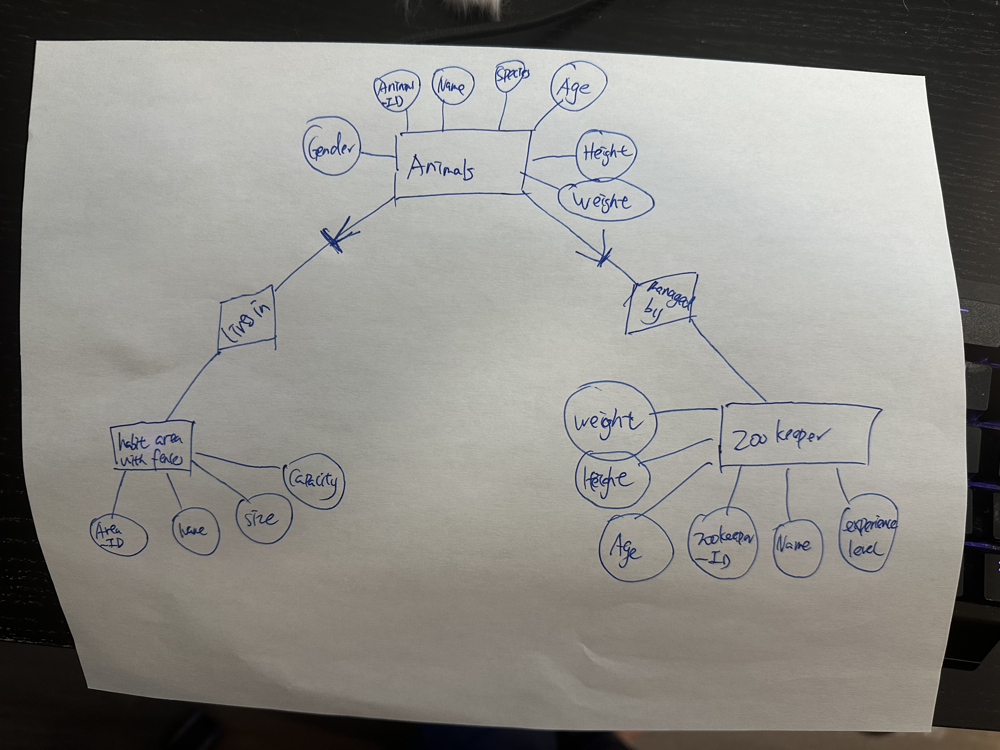

  
Zichong Meng  
Feburary 16 2025  
# HW4
HW 4
(Due 2/17)
Part 1 (50 points): Normalization and Standardization 
Take the iris data set and create two new .csv data sets (25 points each). One that normalizes all columns to have values between 0 and 1 and a second that standardizes all columns to have a mean of 0 and standard deviation of 1.
Push both files to github. 

Part 2 (50 points): ER Diagram 
Create an ER diagram that models a zoo:
Define at least three entities that have several attributes for each entity, their relationship between entities, and their constraints. Argue your decisions. You will graded based on your explanation on why you chose certain constraints. 
What to submit 
Either create a markdown readme file that has a copy of your ER diagram and explanation or .pdf version and push that to github.
Please also submit a link to your github submission to Canvas as well. This helps the TA grade faster. 

# Part 2

## Entities
entity explain: choose to include animals, zookeeper and habit area with fences entities to cover essential part of a managable, operatable zoo.
### 1. Animals
#### Attributes
Animal_ID: each animal's unique ID  
Name: animal's name  
Species: animal's species  
Age: animal's age  
Gender: animal's gender  
Height: animal's height  
Weight: animal's weight  
#### Constraints
Animal_ID needs to be unique.  
Age, Height and Weight needs to be non-negative.  
Gender should be either male or female for animals.  
#### Explain
Animal_ID needs to be unique so each animal can be identified and managed  
Species and Name helps to manage the zoo  
Age, Height and Weight needs to be non-negative because it is not physically possible to be negative  
There should be only two gender for animals  
### 2. Zookeeper
#### Attributes
Zookeeper_ID: each zookeeper's unique ID  
Name: zookeeper's name  
Experience_Level: zookeeper's experience level on animals  
Age: zookeeper's age  
Height: zookeeper's height  
Weight: zookeeper's weight  
#### Constraints
Zookeeper_ID needs to be unique.  
Age, Height and Weight needs to be non-negative.  
Experience_Level should be either beginner, moderate or expert.  
#### Explain
Zookeeper_ID needs to be unique so zookeeper can be identified and managed  
Name helps to manage the zoo and treat zookeeper with respect.  
Age, Height and Weight needs to be non-negative because it is not physically possible to be negative.  
Experience_level helps to assign zookeeper to animals and its should follow the three categories for seperation.  
### Habit Area with Fences
#### Attributes
Area_ID: each area's unique ID  
Name: area's name  
Size: the area size  
Capacity: how many animal can be held  

#### Constraints
Area_ID needs to be unique.  
Size and Capacity needs to be non-negative.  

#### Explain
Area_ID needs to be unique so area can be identified and managed  
Name helps to manage the zoo.  
Size and Capacity needs to be non-negative because it is not physically possible to be negative to held animals.  

## Relationships

### Animal to Habit Area with Fences is many to one (N:1)
Name: habit in  
This is because there are many animals living on each one fo the habit are.
### Animal to Habit Area with Fences is many to many (N:M)
Name: managed by  
This is because many zookeeper will be assigned to many animals, there will be several zookeepers taking care of one animal and each zookeepers will also takes care of many animals
